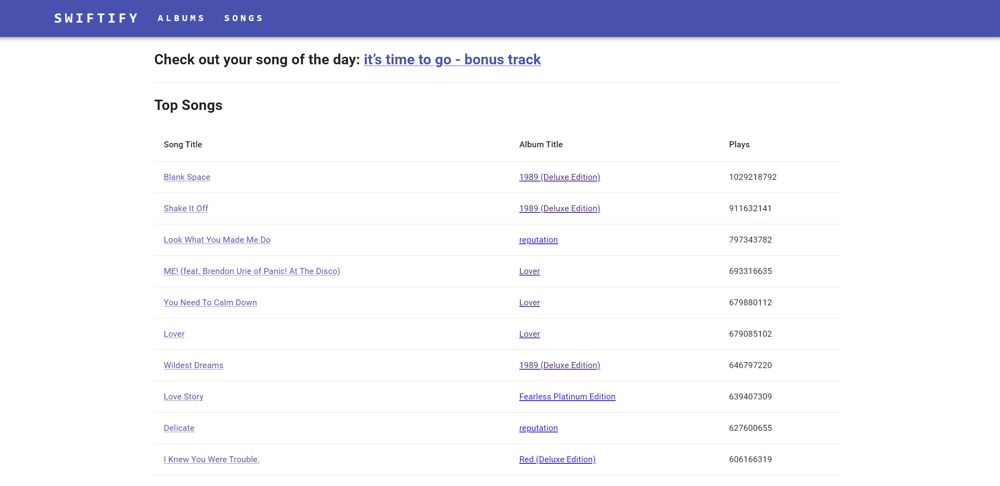
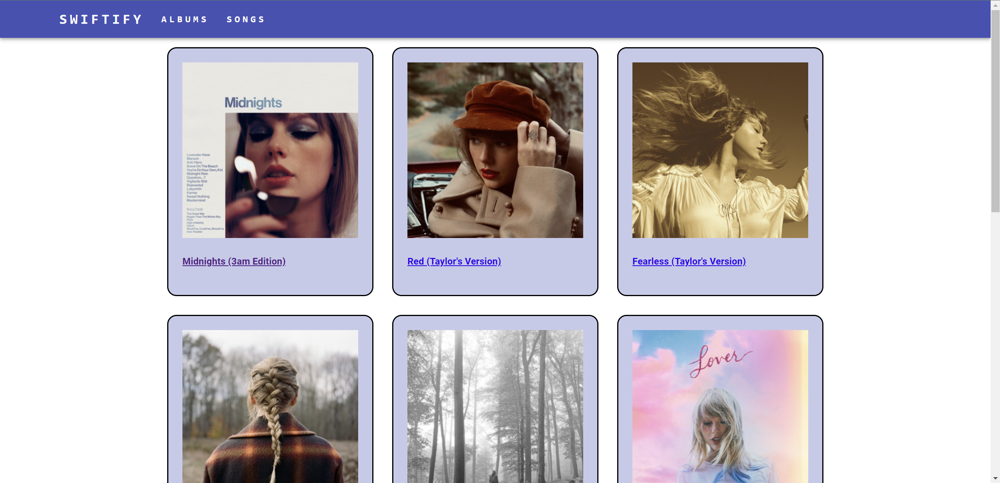
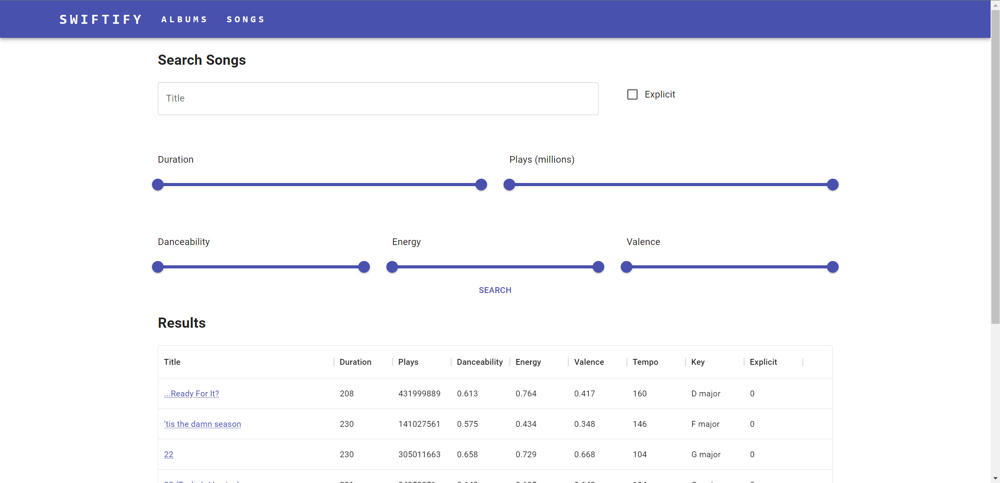
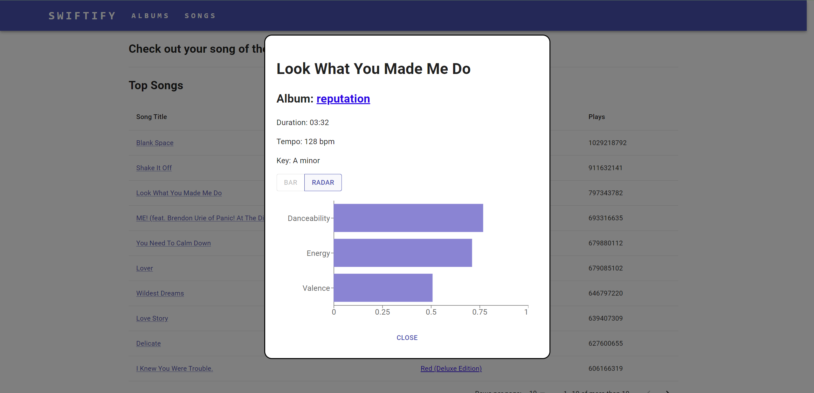
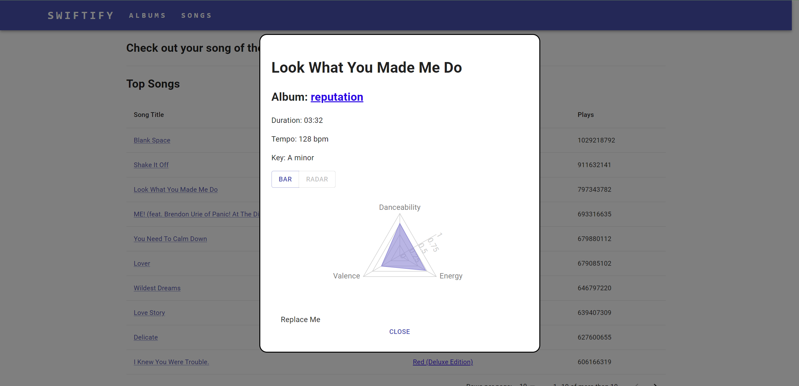

# Mini-Spotify Project:

## Instruction
1. git clone the repo
2. set up your config.json file in both client folder and server folder
3. run ```npm install``` in both client and server folder
4. run ```npm start``` in server folder
5. run ```npm start``` in client folder
6. If it does not automatically open the brower, then manually go to ```http://localhost:3000/```.

## Home page
This page will provide you with a random song and also list songs that are ranked by play times


## Album page
This page display the album of Taylor Swift


## Search page
This page allows the users to search the song based on title, number of plays, danceability, energy, and valence


## Bar chart
This page displays the bar chart of the specific song. The rows include ```Danceability```, ```Energy``` and ```Valence```


## Radar chart
This page displays the radar chart of the specific song. The rows include ```Danceability```, ```Energy``` and ```Valence```
